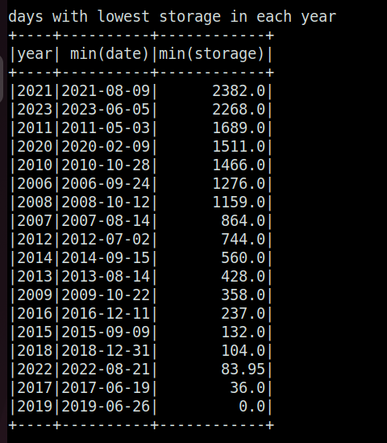
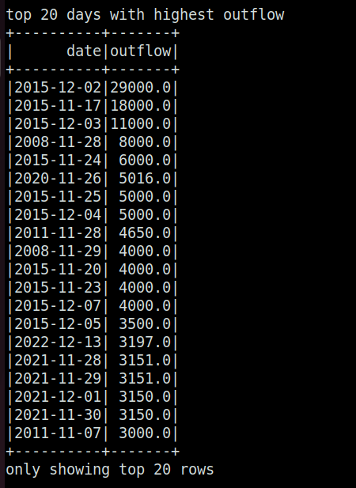

# tn-lake-level-analysis
Analysis of Lake level data in TN

Example Lake: Chembarambakkam

Data fetched and stored in `data/{year}/` in a yearly fashion by running `get_data.py` file with required `year` value.

Average time taken to fetch and write one year of data in csv (with 4 processes): 1.2 min

Data Used from `2006-01-01` to `2023-09-07`, showed following results:

